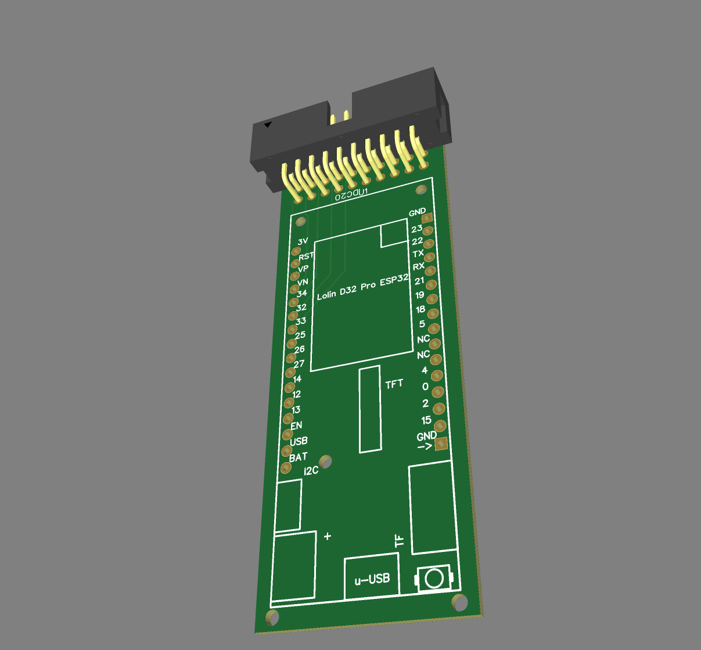

# FujiApple Lolin D32 Pro Adapter

>**_NOTE:_** This is my **FIRST** attempt at building a PCB & I am **VERY MUCH** an amature.  Use this at your own risk as it is very likely I've made some mistakes that could damage things!

This is an **_EXTREMELY_** early prototype adapter for using a Lolin D32 Pro as a standalone FujiNet device for Apple 2 computers.  

Gerbers, BOM & pick & place files are all available in the [production/](production/) directory however, the only component listed is an IDC 20-pin box header which is easy to solder on manually.

The [schematic](Schematic_FujiApple-Lolin-D32-Pro.pdf) is available as a PDF.

Special thanks to FozzTexx for the original pinmapping for making this work.  
